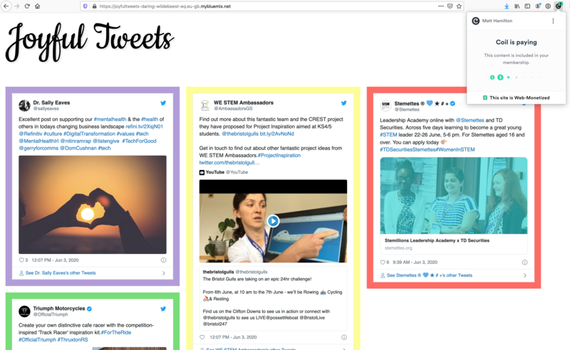

# Joyful Tweets

There are a lot of pretty bad things going on in the world right now. Whilst not wanting to ignore or minimise them, sometimes it would be nice to just take a break for our own mental health. Wouldn't it be great if we could look at just the "joyful" tweets in our Twitter timeline?

I have build a small web app that authenticates to Twitter and fetches your Twitter timeline and filters it to analyse each of the tweets to just show the ones that might be "joyful" (and remove those that are classified as "angry").

This was a part of the [Grant for the Web / DEV Hackathon](https://dev.to/devteam/announcing-the-grant-for-the-web-hackathon-on-dev-3kd1) and was live-coded on a Twitch stream, a recording of which is at: https://www.cinnamon.video/watch?v=333183211095983753

